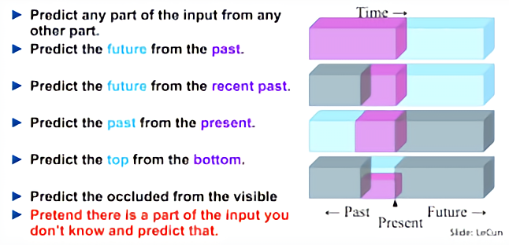
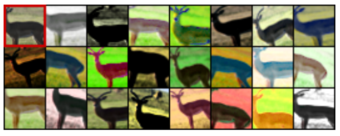

# Study-Self-Supervised-Learning
> Self Supervised Representation Learning을 정리한 [원문](https://lilianweng.github.io/posts/2019-11-10-self-supervised/)을 번역하며 공부를 시작합니다. (진행중...)  
> 수식작성 참고 [link](https://github.com/black7375/fluid-size/wiki/The-theory-of-font-size-and-readability)  
> Github Dark theme를 기준으로 작성됐습니다.
# Self-supervised Representation Learning
딥러닝과 머신러닝에서 충분한 레이블 정보가 주어진 지도학습(supervied learning)은 이미 매우 좋은 성능을 내고 있습니다. 좋은 성능은 일반적으로 많은 양의 레이블 정보가 필요하지만, 레이블링 작업은 비용 문제로 인해 규모를 키우기가 어렵습니다. 라벨링 되지 않은 데이터가 사람에 의해 라벨링 된 데이터에 비해 상당히 많은 것을 고려하면, 해당 데이터를 사용하지 않는 것은 다소 비효율적이라 생각됩니다. 하지만 레이블링이 안 된 데이터를 사용하는 비지도학습(unsupervised learning)은 지도학습에 비해 쉽지 않으며 훨씬 덜 효율적으로 작동합니다.

만약 레이블링 되지 않은 데이터에 대한 레이블을 무료로 얻을 수 있고 얻은 레이블을 바탕으로 지도학습 관점으로 학습이 가능하다면 어떨까요? 이를 위해 레이블링이 되어있지 않은 데이터에 대해 특별한 형태의 예측을 하도록 하는 지도학습을 정의해 학습하고, 학습한 모델의 정보를 일부분만 사용합니다. 우리는 이것을 **_self supervised leraning_** 이라고 합니다.  

이 아이디어는 자연어처리에서 이미 많이 사용되고 있었습니다. 자연어처리 모델의 기본 태스크는 과거의 시퀀스를 바탕으로 다음 단어를 예측하는 것 입니다. [BERT](https://arxiv.org/abs/1810.04805)는 스스로 생성한 레이블을 통해 정의된 두개의 유사 태스크를 추가했습니다. 

  

  <em>Fig. 1 self-supervised learning 구축 과정을 설명, [LeCun's Talk](https://www.youtube.com/watch?v=7I0Qt7GALVk)  </em>

다음 [저장고](https://github.com/jason718/awesome-self-supervised-learning)를 확인하면 잘 엄선된 self-supervised learning 연구 리스트를 확인할 수 있습니다. 깊이 있는 학습에 관심이 있다면 반드시 논문을 읽어보시기를 바랍니다.  

해당 포스트는 NLP와 Generative model에 대해 자세히 설명하지 않습니다.

## Why Self-Supervied Learning?
Self-supervised learning 데이터로부터 얻는 다양한 레이블 정보를 자유롭게 활용 가능하다는 장점이 있습니다. 해당 연구가 진행된 동기는 꽤 직관적입니다. 완벽히 레이블링 된 데이터셋을 만드는 것은 매우 큰 비용이 소모되지만, 레이블이 되어있지 않은 데이터는 매 순간 생성되고 있습니다. 이 더 많은 레이블링 되지 않은 데이터셋을 사용하기 위해, 데이터셋 자체의 객관적인 특성을 배우도록 지도학습을 진행하는 방법이 있습니다.  

*self-supervised learning*은 *pretext task*라고도 부르며 지도학습의 손실함수를 사용할 수 있게 합니다. 하지만, 여기서 새롭게 발명해낸 태스크에 마지막 성능은 보통 중요하지 않습니다. 대신 해당 태스크를 통해 학습된 중간 단계의 representation이 의미론적 또는 구조론적 의미를 지니거나, 실질적인 *downstream task*에 도움이 되기를 바랍니다.  

예를 들어 이미지를 무작위로 회전시킨 후 모델이 얼마만큼 이미지가 회전하였는지를 학습할 수 있습니다. 회전 예측 태스크가 종료되면 마치 보조 태스크를 대할 때처럼, 실질적인 정확도는 중요하지 않습니다. 하지만 모델이 실제 환경 태스크에 도움이 되는 높은 품질의 잠재 변수를 학습하기를 기대합니다. 실제 환경 태스크의 예시로, 매우 적은 레이블을 가지고 모델을 학습해야 하는 경우가 있습니다.  

포괄적으로 말하자면, 모든 Generative model은 self-supervised로 여겨질 수 있습니다만, 목적이 서로 다릅니다. Generative model은 다양하고 실제와 유사한 이미지를 생성하는 것에 집중하지만, self-supervisd representation learning은 다양한 환경에서 도움이 될 만한 범용성 있는 좋은 특징을 추출하는 것을 목표로 합니다.  

## Image-Based
이미지 수준의 많은 self-supervised representation learning 방법이 제안되었습니다. 일반적인 절차는 레이블이 지정되지 않은 하나 이상의 pretext task에 대해 모델을 학습한 후, 모델의 중간 특징 계층 하나를 사용하여 ImageNet 분류에 대한 다항 로지스틱 회귀분석을 진행하는 것입니다. 마지막 분류성능은 얼마나 representation을 잘 학습했는지를 나타내게 됩니다.  

최근, 일부 연구자들은 가중치를 공유하며 레이블링 된 데이터에 대해 지도학습을 진행하고 레이블이 되지 않은 데이터에 대해서는 self-supervised pretext task를 **동시에** 진행하는 방법에 제안되고 있습니다. ( [Zhai et al, 2019](https://arxiv.org/abs/1905.03670), [Sun et al, 2019](https://arxiv.org/abs/1909.11825) )  

### Distortion
일반적으로 조금의 왜곡은 원본의 semantic 의미나 geometric 형태를 바꾸지 않을 것이라 기대합니다. 조금의 왜곡은 왜곡에 변하지 않는(invariant) 특징을 학습했을 때, 원본 이미지와 같다고 여겨질 수 있을 것입니다.  

**`Exemplar-CNN`**([Dosoviskiy et al., 2015](https://arxiv.org/abs/1406.6909))는 레이블링 되지 않은 이미지 패치를 surrogate 훈련데이터셋으로 만들어냈습니다.
1. 크기가 32x32 pixel인 표본패치는 다양한 위치와 크기의 서로 다른 이미지로, 객체의 일부 혹은 가장자리(edge) 정보를 포함하거나 상당한 gradient를 포함한 이미지입니다. 이런 패치들을 *exmplary* 패치라고 합니다.
2. 각각의 패치들은 다양한 랜덤변환(i.e. translation, rotation, scaling, etc)이 적용되어 왜곡됩니다. 왜곡된 패치들은 모두 같은 *surrogate class*에 포함됩니다.
3. *pretext task*는 surrogate class 들을 구별해주는 것이 됩니다. 이러한 방법을 통해 원하는 만큼의 surrogate class들을 만들 수 있습니다.

  

  <em>Fig. 2. 좌측 상단 사슴의 이미지가 원본이미지이며, 다른 모든 이미지는 원본 이미지에 대해 랜덤 변환이 적용된 패치들입니다.
    모든 패치들은 pretext task에서 같은 surrogate class로 분류되어야 합니다.
  </em>

**`Rotation`**([Gidaris et al. 2018](https://arxiv.org/abs/1803.07728)), 이미지의 회전은 주어진 이미지의 semantic 맥락을 유지한 채 변형 가능한 값싼 방법입니다. 각각의 input 이미지는 $90^{\circ}$의 배수로 회전해, 각각 [ $0^{\circ}, 90^{\circ}, 180^{\circ}, 270^{\circ}$ ]  회전하게 됩니다. 모델은 이미지가 얼만큼 회전했는지를 학습하게 되고, 이는 4-class 분류문제가 됩니다.

### Patches

### Colorization

### Generative Modeling

### Contrastive Learning

## Video-Based
비디오는 의미상으로 연관된 일련의 프레임들입니다. 이때, 시간상으로 가까운 프레임은 멀리 있는 프레임보다 상관관계가 더 높습니다. 그리고 프레임의 순서는 물체의 부드러운 움직임과 중력이 바닥을 향하는 것과 같은 추론 혹은 물리 규칙을 나타내기도 합니다.  
  
비디오에 Self-supervised learning을 적용하는 일반적인 순차는, 먼저 레이블이 지정되지 않은 비디오를 대상으로 하나 이상의 pretext task를 통해 모델을 훈련합니다. 이후 action classification, segmentation, object tracking과 같은 downstream task 대한 모델에 intermediate feature layer 하나를 제공하여 간단한 fine-tune을 진행하게 됩니다.  

### Tracking
물체의 움직임은 일련의 비디오 프레임들입니다. 이에 같은 물체가 가까운 프레임에서 화면에 나타나는 위치의 차이는 크지 않으며, 일반적으로 물체나 카메라의 작은 움직임에 의해 발생합니다. 따라서 가까운 프레임에 걸쳐 같은 개체에 대해 학습된 visual representation은 latent feature space에서 서로 가까워야 합니다. 이러한 아이디어에 기반하여, [Wang & Gupta, 2015](https://arxiv.org/abs/1505.00687)는 비디오에서 `움직이는 물체를 추적`하는 방식으로 visual representation을 비지도 학습하는 방식을 제안했습니다.  
  
패치(eg. 30 frames)가 정확하게 추적된 움직임을 포함한다 했을때, 훈련데이터의 한 비디오에서 가장 첫 패치를 $X$로 마지막 패치는 $X^{+}$로 선택합니다. 만약 이 두 패치의 특징 벡터 간의 차이를 최소화하는 방향으로 모델을 학습한다면, 모델은 모든 패치를 같은 값으로 매핑하는 방향으로 학습됩니다. 이런 trivial solution을 막고자, 무작위로 $X^{-}$ 패치를 추가합니다. 이 모델은 feature space에서 $X$와 $X^{+}$ 간의 cosine distance를 $X$와 $X^{-}$ 보다 가깝게 하여 representation을 학습합니다. 이는 $D(X, X^{-}) > D(X, X{+})$ 로 표현되고 $D(.)$는 다음과 같습니다.
$$ D(X_{1}, X_{2}) = 1 - \frac{f(X_{1})f(X_{2})}{||f(X_{1})||~||f(X_{2})||} $$
 
이때, 손실함수는 다음과 같습니다.
$$ L(X, X^{+}, X^{-}) = max(0, D(X, X^{+}) - D(X, X^{-}) + M) + weight \ decay \ regularization \ term $$
$M$은 두 거리 사이의 최소 간격을 제어하는 스칼라 상수입니다; 논문에선 $M=0.5$입니다. 이 손실함수는 최적의 사례로 $D(X, X^{-}) >= D(X, X^{+}) + M$를 가집니다.  
  
이런 형태의 손실함수는 다중 인물에 대한 다중 카메라 각도에서 촬영된 이미지 데이터셋에 대한 얼굴 인식 task에서 [triplet loss](https://arxiv.org/abs/1503.03832)로 불리기도 합니다. 
